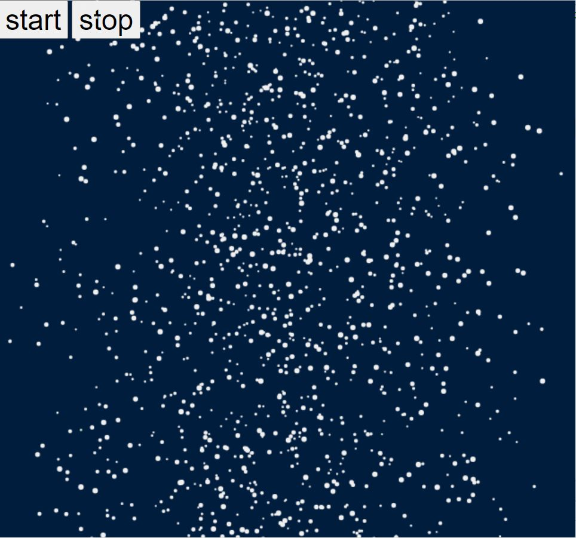

# effect-snow
[CodePen Demo](https://codepen.io/zhua/full/eYdEdjV)



## Global import
From package
```
npm install effect-snow
```
```html
<script src="node_modules/effect-snow/dist/snow.min.js"></script>
```

or from CDN
```html
<script src="https://unpkg.com/effect-snow"></script>
```
## ESM import
```js
import Snow from 'effect-snow';
```

## Usage
```html
<body>
  <button id="start">start</button>
  <button id="stop">stop</button>
</body>
```
```js
let it = new Snow(document.querySelector('body'));

document.getElementById('start').addEventListener('click', () => it.start());
document.getElementById('stop').addEventListener('click', () => it.stop());
```

## API Reference
### Constructor
```js
const snow = new Snow(node, options);
```
|name|description|
|---|---|
|node `<Node>`| element to apply the effect to|
|options `<object>`| see [additional options](#additional-options)|

### Methods
```js
snow.start();
snow.stop();
```
|name|description|
|---|---|
|`start()`|Start the snow if it is not started yet. This will clear any existing snow immediately.|
|`stop()`|Stop the snow. This will still allow the remaining snow to finish the animation.|

### Additional options

|name|range|default|
|---|---|---|
|`indentisity` `<number>`|`[1, 5]`| `3`|
|`span` `<number>`|`-`| `375`|

```js
// create a snow scene that has the highest intensity and each
// snow spiral width is 400px.
let it = new Snow(element, { intensity: 5, span: 400 });
```

## Credits
The physics of the snow fall is adapted from [Aatish Bhatia's Snow Globe Experiment](https://aatishb.com/experiments/snowglobe/).
